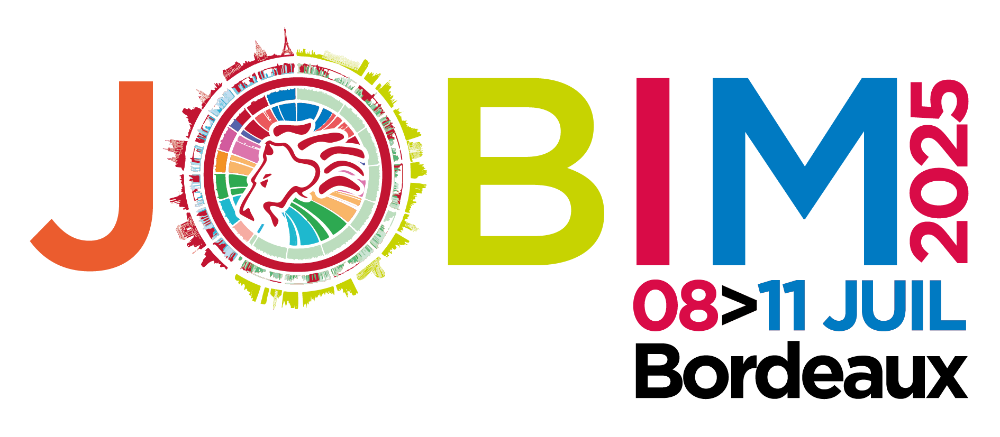
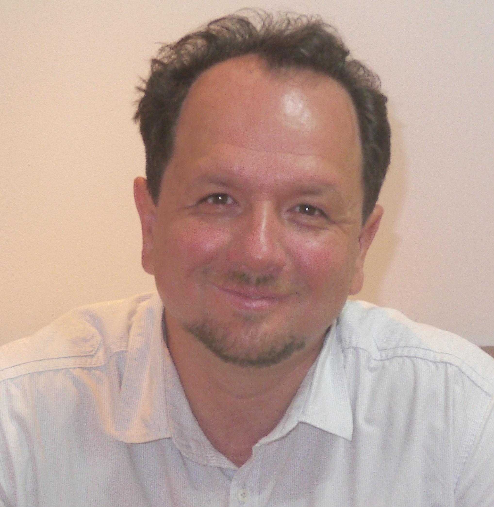
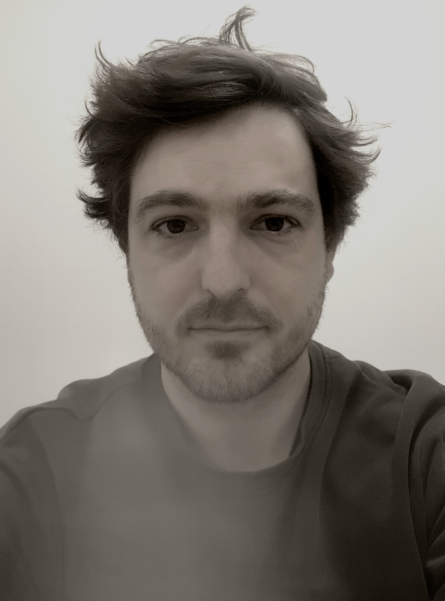
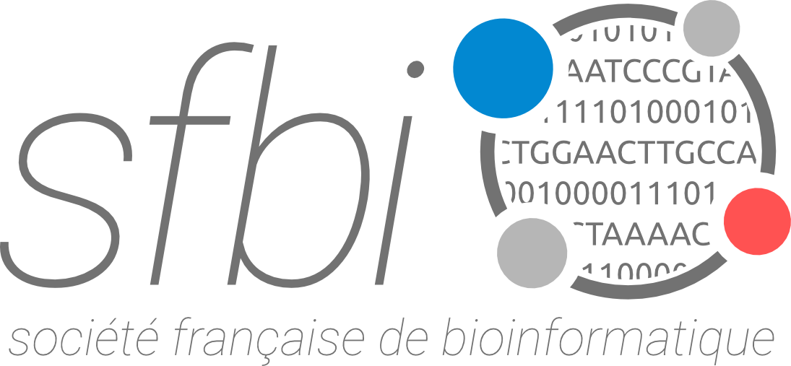
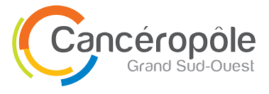
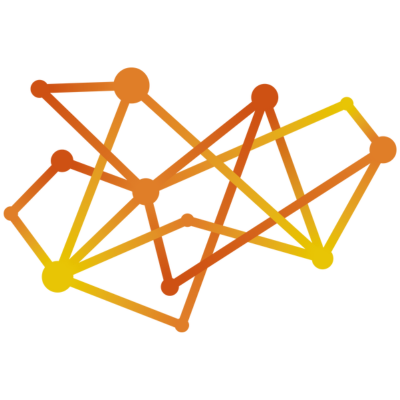

# Mini-symposium JOBIM 2025: AI in Healthcare: From Fundamentals to the Clinic

**Hosted by**: 

Artificial Intelligence (AI) is reshaping the landscape of modern medicine, from early diagnosis to personalized treatment and clinical decision support. This mini-symposium, "AI in Healthcare: From Fundamentals to Clinic," aims to explore the real-world impact of AI in clinical environments, with a particular focus on its integration into diagnostic and therapeutic workflows in hospitals.

Bringing together researchers, clinicians, and AI experts, the event fosters interdisciplinary dialogue around both the opportunities and the challenges posed by AI. Topics will include methodological rigor, regulatory requirements (such as accreditation standards like COFRAC), and the evolving role of healthcare professionals in an increasingly data-driven environment.

The mini-symposium will feature three expert talks (35 minutes each, followed by 5 minutes for questions), offering diverse perspectives ranging from theoretical insights to practical implementations of AI in healthcare. These presentations will be followed by a roundtable discussion, where the speakers will engage in a cross-disciplinary dialogue on the promises, limitations, and future directions of AI in clinical settings. Audience participation will be encouraged to enrich the conversation.

Through expert talks and a closing panel discussion, this symposium seeks to bridge the gap between innovation and clinical reality — questioning not only what AI can do for healthcare, but how it should be implemented responsibly, effectively, and ethically.

To showcase the diversity of approaches to AI in healthcare, the symposium brings together three distinguished experts. Each speaker will share their unique perspective on the development, implementation, and implications of AI in medicine.

---

  
  

    <strong>Jean-Marc Alliot</strong>  
     <em>Scientific Director of Artificial Intelligence and Data, Toulouse University Hospital</em>
    
Jean-Marc Alliot offers a critical and historical perspective on the evolution of AI in medicine, highlighting both major advances and ongoing methodological challenges. He currently leads the Health Data Warehouse and coordinates AI initiatives at Toulouse University Hospital, with a strong research focus in oncology.

  

**Title**: Artificial Intelligence and Medicine: A "Success Story"

**Talk Abstract**: Since the 1950s, the history of artificial intelligence has oscillated between myth and reality, reflecting both its spectacular advances and its inherent limitations. In the medical field, AI offers new perspectives, but careful attention to methodological constraints remains essential. Exploring its evolution helps us better understand its current challenges and future potential.

---

  
  

    <strong>Daniel Racoceanu</strong>  
     <em>Professor of Biomedical Image Analysis, Sorbonne University & Paris Brain Institute (ICM)</em>
    
Daniel Racoceanu explores explainable and responsible AI in biomedical imaging through applications in neurodegeneration and computational pathology. He leads the ARAMIS team at Inria, focusing on interpretable models that integrate imaging, clinical, and omics data for ethical, personalized healthcare.

  

**Title:** Explainable Artificial Intelligence (XAI): A Modern Ariadne's Thread in Biomedical Imaging
Supporting Knowledge Discovery and Frugal, Environmentally Respectful Computational Approaches
Use Cases:
1. PhagoStat – Efficient Quantification of Cell Phagocytosis in Neurodegenerative Disease Studies using phase contrast video microcopy.
2. Virtual Staining – Scalable, Trustworthy Generative Modeling for Multi-Staining from H&E Whole Slide Images

**Talk Abstract: **PhagoStat: A Scalable and Interpretable Framework for Quantifying Phagocytosis in Neurodegenerative Disease Research
This study presents PhagoStat, a real-time, scalable, and interpretable deep learning pipeline for quantifying phagocytosis in dynamic, unstained cells from phase-contrast video microscopy - an essential task in neurodegenerative disease research. The framework handles large datasets efficiently, incorporates quality control modules to address imaging issues such as blurring or drift, and features explainable segmentation to enhance transparency beyond traditional black-box models. Designed to balance interpretability and performance, it optimizes both algorithmic accuracy and execution speed. Applied to microglial cells in frontotemporal dementia (FTD), the pipeline revealed that FTD-mutant cells are larger and exhibit heightened phagocytic activity compared to controls. Both the methodology and dataset have been released as open-source tools to foster reproducibility and accelerate future research in neurodegeneration (Scientific Reports : https://www.nature.com/articles/s41598-024-56081-7).
Virtual Staining in Computational Pathology: This work introduces a generative AI-based approach to virtual staining, addressing the limitations of traditional chemical staining—which is time-consuming, costly, and environmentally burdensome. The proposed system uses a single Hematoxylin and Eosin (H&E) encoder and multiple stain-specific decoders to virtually generate up to eight distinct stains from a single H&E whole-slide image. It ensures accuracy through label-free training, artifact-reducing loss functions, and integrated self-inspection mechanisms that produce confidence heatmaps for pathologists. The model integrates automatic quality assurance steps and is available as an open-source, browser-accessible, cloud-based proof-of-concept platform, enabling non-technical users to perform virtual staining. A novel dataset of 480 paired H&E-stained whole slide images from pediatric Crohn’s disease is also released to support the broader research community in computational pathology.

---

  
  

    <strong>Simon Cabello-Aguilar</strong>  
     <em>Engineer in Bioinformatics, Montpellier University Hospital</em>
    
Simon Cabello-Aguilar presents a real-world implementation of AI in oncology: an NGS-based tool for detecting MET amplification in lung cancer. Based in the tumor biology lab at Montpellier, he specializes in developing clinically validated bioinformatics pipelines for precision medicine.

  

**Title**: Optimized NGS-based de novo MET amplification detection for improved lung cancer patient management.

**Talk abstract**: We developed an AI-assisted NGS- based method for detecting and stratifying MET amplification (METamp) in NSCLC patients, achieving high accuracy and sensitivity. Among 1,932 patients, de novo METamp was identified in 2.4% and stratified into Low-, Medium-, and High- amplification groups, with significant differences in overall survival and progression- free survival. These findings highlight the potential clinical value of routine METamp screening to guide treatment and trial inclusion in NSCLC.

---
**Aknowledgements**

We warmly thank our sponsors for their support:

  
  
  

Their support makes this event possible, encouraging interdisciplinary collaboration between medicine and AI.

---

**Organising committee**
- Delphine Potier
- Elodie Darbo
- Laetitia Bourgeade
- Charles Van Goethem
